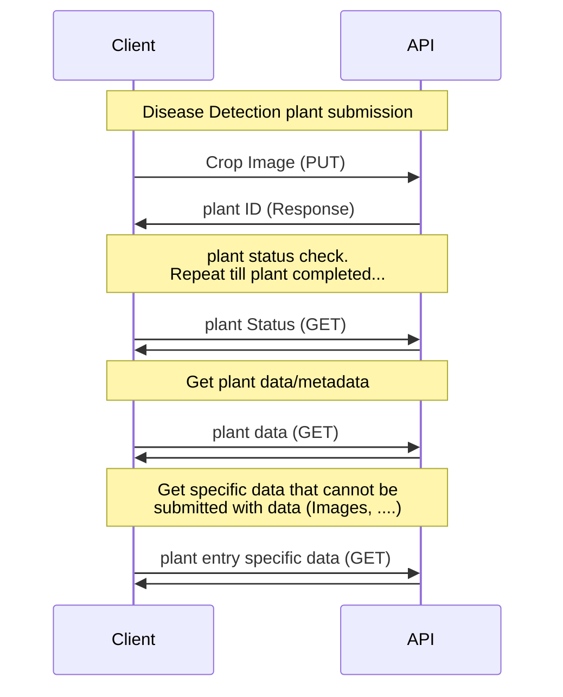

# Disease Detection API
This documents the disease dection API RESTful sequence diagram. This defines the process for submitting a disease deteciton plant, and how a client should retrieve data. This sequence diagram only contains that Client and API layer, as the architecture of the the Application layer and Data layers have not been decided.

The plant submission should contain an image of the crop to perform disease detection on. The server will respond with an a GUID that will serve as the plant ID for retrieving the data. The client then can request the plant status, and retrieve the plant data and metadata when the plant is completed. Data that can not be transmitted over with the initial plant data request, like images, will be requirested individually by the client.

