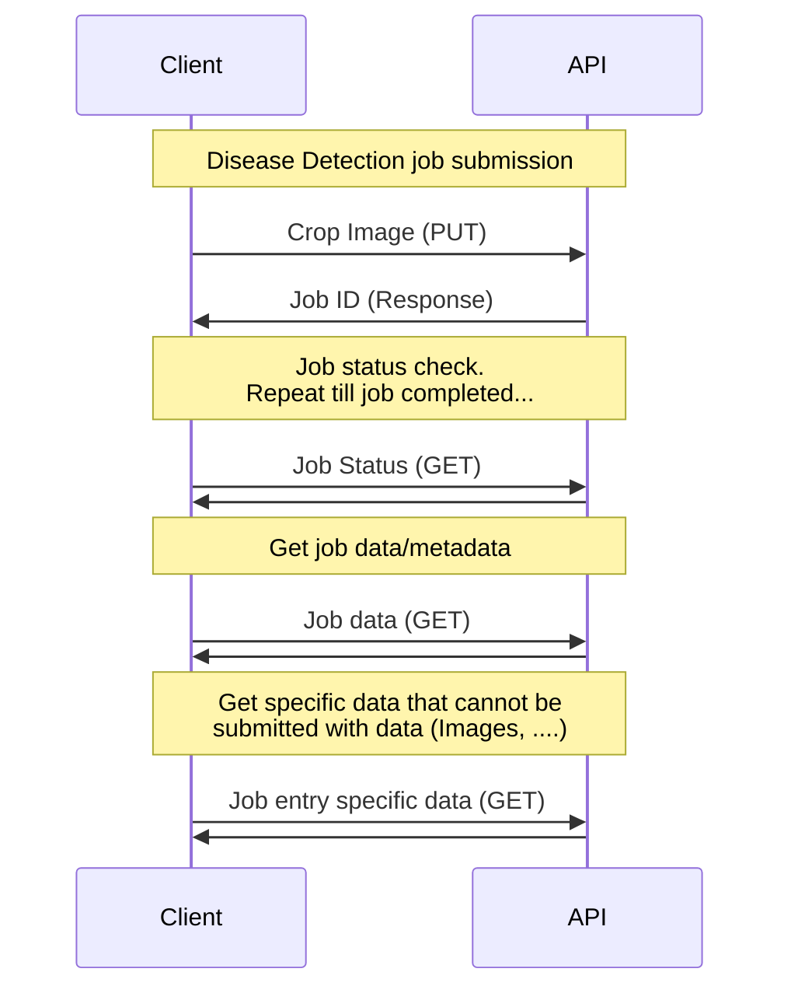

# Disease Detection API
This documents the disease dection API RESTful sequence diagram. This defines the process for submitting a disease deteciton job, and how a client should retrieve data. This sequence diagram only contains that Client and API layer, as the architecture of the the Application layer and Data layers have not been decided.

The job submission should contain an image of the crop to perform disease detection on. The server will respond with an a GUID that will serve as the Job ID for retrieving the data. The client then can request the job status, and retrieve the job data and metadata when the job is completed. Data that can not be transmitted over with the initial job data request, like images, will be requirested individually by the client.

